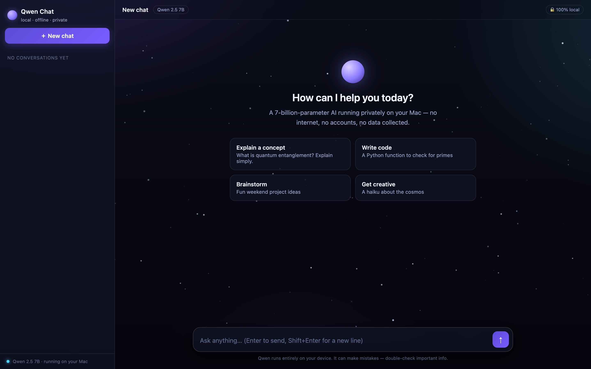
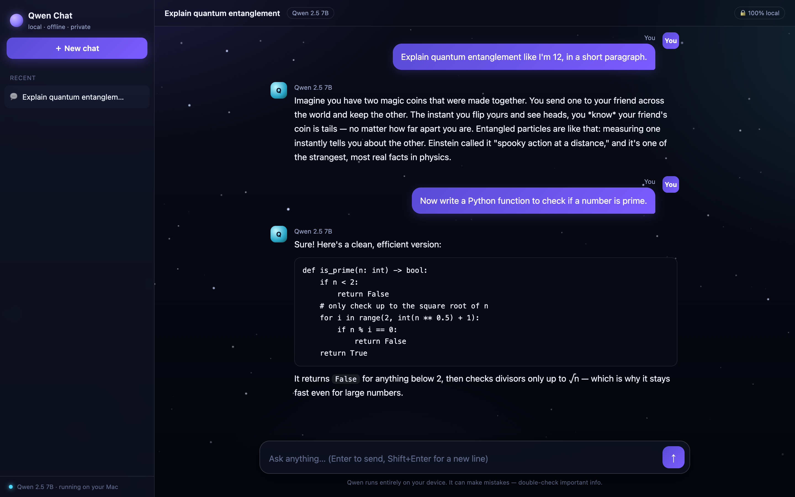

# Qwen 2.5 7B — Local Chat on a Mac 🖥️⚡

A tiny, dependency-free chat UI for running the **Qwen 2.5 7B** language model
**100% locally** on Apple Silicon — no cloud, no API key, no telemetry. Every
token is generated on your Mac's own GPU.

Built as a "how far can an 8 GB M1 MacBook Air actually push a 7-billion-parameter
model?" experiment. The answer: surprisingly far. The UI shows a live
**tokens/sec meter** so you can watch your machine work.



> A real conversation — streaming replies, code blocks, and saved history, all offline:



---

## ✨ Features

- **ChatGPT-style interface** — clean, familiar, and easy for anyone to use
- **Animated dark-space theme** — twinkling starfield + shooting stars
- **Saved chat history** — conversations persist in your browser (localStorage); switch between them in the sidebar
- **Fully local & offline** — runs on [Ollama](https://ollama.com); nothing leaves your machine
- **Streaming replies** — tokens render live as the model types, with a **Stop** button
- **Live tok/s meter** — see exactly how fast your hardware is
- **Multi-turn memory** — real back-and-forth conversation
- **Code blocks with one-click copy** + markdown rendering
- **Mobile-friendly** — collapsible sidebar
- **Zero Python dependencies** — the server is ~90 lines of Python standard library
- **One HTML file** — no build step, no npm, no framework

---

## 🧰 Requirements

- **Apple Silicon Mac** (M1/M2/M3/M4). Works on Intel/Linux too, just slower.
- **~8 GB RAM minimum** (16 GB+ is comfier).
- **~5 GB free disk** for the model.
- **Python 3** (ships with macOS).
- **[Ollama](https://ollama.com)** (install command below).

---

## 🚀 Setup

**1. Install Ollama**

```bash
brew install ollama
# or download the app from https://ollama.com/download
```

**2. Start the Ollama server** (leave it running in its own terminal)

```bash
ollama serve
```

**3. Pull the model** (~4.7 GB, one-time download)

```bash
ollama pull qwen2.5:7b
```

**4. Clone this repo and start the chat server**

```bash
git clone https://github.com/ZANYANBU/qwen-m1-chat.git
cd qwen-m1-chat
python3 chat_server.py
```

Then open **http://localhost:8100** in your browser. That's it. 🎉

> The **first** reply is slower — that's the model loading into RAM. After that it stays warm.

---

## 🧩 How it works

```
  ┌──────────────┐   POST /chat    ┌───────────────┐   /api/chat    ┌──────────────┐
  │   Browser    │ ──────────────▶ │ chat_server.py│ ─────────────▶ │    Ollama    │
  │ (index.html) │ ◀────────────── │ (stdlib proxy)│ ◀───────────── │  Qwen 2.5 7B │
  └──────────────┘  streamed NDJSON └───────────────┘  streamed tokens└──────────────┘
        :8100                            :8100                            :11434
```

Ollama serves the model on port `11434`. `chat_server.py` does two small jobs:
serve the HTML page, and proxy chat requests to Ollama — **streaming tokens
straight through** so the browser can render them as they're generated. The
proxy also sidesteps browser CORS restrictions on the Ollama port.

---

## 📁 Files

| File | What it does |
|------|--------------|
| [`chat_server.py`](chat_server.py) | ~90-line Python stdlib server: serves the page + streams Ollama responses |
| [`index.html`](index.html) | The entire chat UI — HTML, CSS, and vanilla JS in one file |
| [`run.sh`](run.sh) | Convenience script: checks Ollama, pulls the model if needed, starts the server |
| `README.md` | This file |

---

## 🔧 Customize

**Use a different / smaller model** — edit the `MODEL` line in `chat_server.py`:

```python
MODEL = "qwen2.5:7b"     # try "qwen2.5:3b" (faster) or "llama3.1:8b"
```

then `ollama pull <that-model>` and restart the server.

**Change creativity** — the `temperature` option is in `chat_server.py` (0 = focused, 1 = creative).

**Change the port** — edit `PORT` in `chat_server.py` (default `8100`).

---

## 🩺 Troubleshooting

| Problem | Fix |
|---------|-----|
| `Ollama not reachable` | Run `ollama serve` in a separate terminal first. |
| Model replies very slowly / Mac fans spin | Normal on 8 GB — a 7B model sits near the RAM ceiling. Try `qwen2.5:3b` for a snappier feel. |
| `address already in use` | Something's on port 8100. Change `PORT` in `chat_server.py`. |
| First reply hangs for ~30s | The model is loading into memory. Only happens once per session. |

---

## 📊 Model sizes vs an 8 GB Mac

| Model | Disk (4-bit) | Feel on 8 GB M1 |
|-------|-------------|-----------------|
| `qwen2.5:3b` | ~2 GB | Snappy, smooth |
| `qwen2.5:7b` | ~4.7 GB | The sweet spot — near-flagship quality, still usable |
| `llama3.1:8b` | ~4.9 GB | The absolute ceiling — smart but swaps |

---

## 📜 License

MIT — do whatever you like. See [LICENSE](LICENSE).

---

*Built for fun to see what a laptop can really do. If it made you smile, drop a ⭐.*
