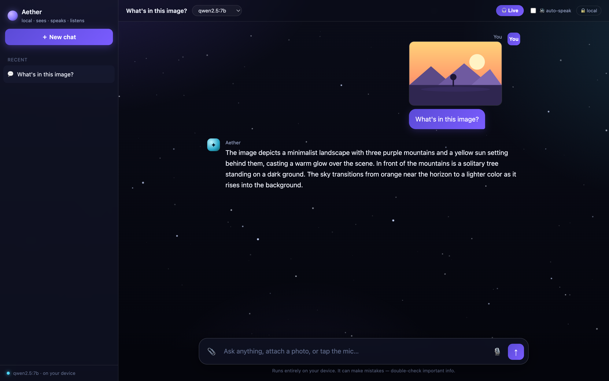

# ✦ Aether — private, local AI for everyone

*Like the invisible medium once thought to fill all of space — an intelligence that runs quietly, everywhere, on your own machine.*

A clean, friendly chat interface for running AI **entirely on your own computer**.
No cloud. No API keys. No sign-up. No data collection. **Nothing you type, say, or
show it ever leaves your device.**

Works with **any model** you install through [Ollama](https://ollama.com) — Qwen,
Llama, Mistral, Gemma, Phi, and more — and adds the things that make a local model
actually pleasant to use: **image understanding, voice, and a hands-free Live mode.**


> **🎧 Live mode** — just talk. It hears when you stop, thinks, and talks back —
> then listens again. Talk over it to interrupt. Like Gemini Live, but 100% private.


> **👁️ It can see.** Attach any image and ask about it — the app switches to a vision model automatically:



---

## 💡 Why local?

| | Cloud chatbots | This |
|---|---|---|
| Your data | Sent to a company's servers | **Never leaves your machine** |
| Cost | Monthly subscription / API fees | **Free** |
| Internet | Required | **Works fully offline** |
| Accounts | Sign-up, logins | **None** |
| Models | Whatever they offer | **Any open model you choose** |

Perfect for private notes, sensitive work, flaky-internet situations, or just
learning how modern AI works without a bill.

---

## ✨ What it can do

- **💬 Chat** with any local model — swap models from a dropdown, no restart
- **👁️ See images** — attach, paste, or drag in a photo and ask about it
- **🎧 Live voice mode** — hands-free conversation with talk-back and barge-in
- **🔊 Read replies aloud** with your computer's built-in voices
- **🎙️ Talk to it** — your speech transcribed privately, on-device (optional)
- **📝 Saved history** — conversations stay in your browser, organized in a sidebar
- **⚡ Streaming replies** with a live speed meter, code blocks, and one-click copy
- **📱 Works on mobile** browsers on your network, too
- **🪶 No dependencies** for the core — the whole server is one short Python file

---

## 🚀 Get started (about 5 minutes)

### 1. Install Ollama (the local model engine)

- **Mac / Windows / Linux:** download from **[ollama.com/download](https://ollama.com/download)**
  (or on Mac with Homebrew: `brew install ollama`)

Then start it:

```bash
ollama serve
```

### 2. Download a model

```bash
ollama pull qwen2.5:7b      # great all-rounder (~4.7 GB)
```

Low on RAM or want it snappier? Use a smaller one:

```bash
ollama pull llama3.2:3b     # fast + light (~2 GB)
```

Want image understanding? Also grab a vision model:

```bash
ollama pull qwen2.5vl:3b    # lets it "see" photos (~3.2 GB)
```

### 3. Download this app and run it

```bash
git clone https://github.com/ZANYANBU/aether.git
cd aether
python3 chat_server.py
```

Open **http://localhost:8100** in your browser. Pick your model from the dropdown
and start chatting. That's it. 🎉

> **Even simpler:** run `./run.sh` — it starts Ollama, grabs the models, and opens the app for you.

### 4. (Optional) Turn on voice

For hands-free 🎧 Live mode and the 🎙️ mic, add local speech-to-text:

```bash
python3 -m venv .venv
.venv/bin/pip install faster-whisper
.venv/bin/python chat_server.py
```

(Talk-back / read-aloud works without this — it uses your browser's built-in voices.)

---

## 🎛️ Use any model you like

The dropdown at the top automatically lists **every model you've installed**. Pull
whatever you want and it shows up:

```bash
ollama pull mistral         # Mistral 7B
ollama pull gemma2:2b       # Google Gemma
ollama pull phi3.5          # Microsoft Phi
ollama pull deepseek-r1:7b  # a reasoning model
```

Browse the full library at **[ollama.com/library](https://ollama.com/library)**.
When you attach an image, the app automatically switches to a vision-capable model.

---

## 🧩 How it works

```
                                              ┌──────────── Ollama ───────────┐
  ┌──────────────┐   POST /chat    ┌────────────────┐   your chosen model     │
  │   Browser    │ ──────────────▶ │  chat_server.py │ ─▶ (or a vision model    │
  │ (index.html) │ ◀────────────── │  (1 python file)│    when you add an image)│
  └──────────────┘  streamed tokens└────────┬───────┘ ◀── streamed tokens      │
     │        ▲                     POST /transcribe    └────────────────────────┘
   🎙️ mic ───┼──── audio ─────────▶┌────────┴────────┐
   🔊 speaker◀─ your system voices  │  local Whisper  │ (optional, on-device)
     (in the browser, fully local)  └─────────────────┘
```

`chat_server.py` serves the page and relays your messages to Ollama, streaming the
reply back token-by-token. Speech-to-text uses a local Whisper model; text-to-speech
uses your browser's built-in voices. Every part runs on your machine.

---

## 📁 What's inside

| File | What it does |
|------|--------------|
| [`chat_server.py`](chat_server.py) | The whole backend: serves the page, lists your models, relays chat, transcribes voice. Pure Python standard library. |
| [`index.html`](index.html) | The entire app — chat, model picker, vision, voice, and Live mode — in one file. |
| [`run.sh`](run.sh) | One-command launcher (starts Ollama, pulls models, opens the app). |

---

## 🔧 Customize

Edit the top of `chat_server.py`:

```python
DEFAULT_MODEL = "qwen2.5:7b"    # what's selected on first load
VISION_MODEL  = "qwen2.5vl:3b"  # used automatically for images
PORT          = 8100            # change if the port is taken
```

Voice accuracy: Whisper uses `base.en` (fast). For better results, change it to
`small.en` in `chat_server.py`.

---

## 🩺 Troubleshooting

| Problem | Fix |
|---------|-----|
| `Ollama not reachable` | Start it: `ollama serve` in a terminal. |
| Dropdown is empty | Pull a model first: `ollama pull qwen2.5:7b`. |
| 🎙️ mic / 🎧 Live does nothing | Install voice input and run with the venv (setup step 4). |
| Attaching an image errors | Pull a vision model: `ollama pull qwen2.5vl:3b`. |
| Replies are slow | Use a smaller model like `llama3.2:3b`. Bigger models need more RAM. |
| Live mode interrupts itself | It's hearing its own voice — use headphones or lower the volume. |
| `address already in use` | Change `PORT` in `chat_server.py`. |

---

## 🔐 Privacy

This app makes **no outbound internet connections** while you use it. Your chats are
stored only in your own browser (`localStorage`) and can be deleted anytime. Models,
transcription, and speech all run locally. The only time anything is downloaded is the
one-time model pull from Ollama during setup.

---

## 📜 License

MIT — free to use, modify, and share. See [LICENSE](LICENSE).

---

*If this made local AI click for you, drop a ⭐ — it helps others find it.*
