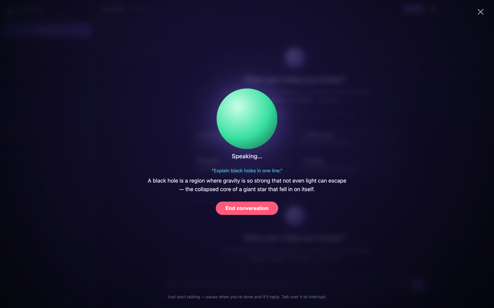

# Qwen — Local Multimodal AI on a Mac 🖥️⚡👁️🎙️

A private, offline AI assistant that **sees, speaks, and listens** — running
**100% locally** on Apple Silicon. No cloud, no API key, no telemetry. Every
token is generated on your Mac's own GPU.

It started as "how far can an 8 GB M1 MacBook Air push a 7-billion-parameter
model?" and grew into a full ChatGPT-style app with **image understanding** and
a **Gemini-style hands-free voice mode** — all on-device.



> **🎧 Live mode** — just talk. It detects when you stop, thinks, and speaks back,
> sentence-by-sentence, then listens again. Talk over it to interrupt.


> Streaming replies, code blocks, and saved history — all offline:


---

## ✨ Features

- **🧠 Smart text** — Qwen 2.5 7B for chat, code, and reasoning
- **👁️ Vision** — attach, paste, or drag in an image and ask about it (auto-routes to Qwen 2.5-VL)
- **🎧 Live voice mode** — hands-free conversation with voice-activity detection, streaming talk-back, auto-listen loop, and barge-in (Gemini Live-style)
- **🔊 Talk-back** — read any reply aloud with your Mac's built-in voices (one tap, or auto-speak)
- **🎙️ Voice input** — speech transcribed **on-device** by local Whisper (optional add-on)
- **ChatGPT-style interface** with an animated dark-space starfield theme
- **Saved chat history** — conversations persist in your browser; switch in the sidebar
- **Streaming replies** with a **Stop** button + live **tok/s meter**
- **Code blocks with one-click copy** + markdown rendering, mobile-friendly
- **Core server has zero dependencies** (Python stdlib); voice input is one optional `pip install`

---

## 🧰 Requirements

- **Apple Silicon Mac** (M1/M2/M3/M4). Works on Intel/Linux too, just slower.
- **~8 GB RAM minimum** (16 GB+ is comfier).
- **~8 GB free disk** (text model 4.7 GB + vision model 3.2 GB).
- **Python 3** (ships with macOS).
- **[Ollama](https://ollama.com)** (install command below).

---

## 🚀 Setup

**1. Install Ollama, then start it**

```bash
brew install ollama      # or download from https://ollama.com/download
ollama serve             # leave running in its own terminal
```

**2. Pull the models** (one-time download)

```bash
ollama pull qwen2.5:7b     # text  (~4.7 GB)
ollama pull qwen2.5vl:3b   # vision (~3.2 GB) — needed for image understanding
```

**3. Clone and run**

```bash
git clone https://github.com/ZANYANBU/qwen-m1-chat.git
cd qwen-m1-chat
python3 chat_server.py
```

Open **http://localhost:8100**. You now have text, vision, and talk-back. 🎉

**4. (Optional) Enable voice input** — local speech-to-text with Whisper:

```bash
python3 -m venv .venv
.venv/bin/pip install faster-whisper
.venv/bin/python chat_server.py     # run with the venv to unlock the 🎙️ mic + 🎧 Live mode
```

> The **first** reply after a mode switch is slower — that's a model loading into RAM.
> On 8 GB, the text and vision models take turns in memory (Ollama swaps them automatically).

---

## 🧩 How it works

```
                                              ┌──────────── Ollama (:11434) ──────────┐
  ┌──────────────┐   POST /chat    ┌────────────────┐   text  →  qwen2.5:7b           │
  │   Browser    │ ──────────────▶ │  chat_server.py │ ─────────▶ image → qwen2.5vl:3b │
  │ (index.html) │ ◀────────────── │  (stdlib proxy) │ ◀───────── streamed tokens      │
  └──────────────┘  streamed NDJSON└────────┬───────┘         └───────────────────────┘
     │        ▲                     POST /transcribe
     │        │                     ┌────────┴────────┐
   🎙️ mic ───┼────── audio ───────▶│  local Whisper  │ (optional, on-device)
   🔊 speaker◀── system voices      └─────────────────┘
     (browser speechSynthesis, fully local)
```

`chat_server.py` serves the page and proxies to Ollama, **picking the vision model
automatically when an image is attached** and streaming tokens straight through.
Speech-to-text runs through a local Whisper endpoint; text-to-speech uses your
browser's built-in local voices. Nothing ever leaves your Mac.

---

## 📁 Files

| File | What it does |
|------|--------------|
| [`chat_server.py`](chat_server.py) | Python stdlib server: serves the page, routes text vs. vision to Ollama, and (optionally) transcribes audio with local Whisper |
| [`index.html`](index.html) | The entire UI — chat, vision, voice, and Live mode — in one file of HTML/CSS/vanilla JS |
| [`run.sh`](run.sh) | Convenience script: checks Ollama, pulls the model if needed, starts the server |
| `README.md` | This file |

---

## 🔧 Customize

**Swap models** — edit the top of `chat_server.py`:

```python
MODEL_TEXT   = "qwen2.5:7b"     # try "qwen2.5:3b" (faster) or "llama3.1:8b"
MODEL_VISION = "qwen2.5vl:3b"   # or "llava:7b", "moondream"
```

then `ollama pull <that-model>` and restart.

**Change creativity** — the `temperature` option in `chat_server.py` (0 = focused, 1 = creative).

**Change the port** — edit `PORT` in `chat_server.py` (default `8100`).

**Voice quality** — Whisper uses `base.en` by default (fast). For better accuracy edit
`WhisperModel("base.en", ...)` to `"small.en"` in `chat_server.py`.

---

## 🩺 Troubleshooting

| Problem | Fix |
|---------|-----|
| `Ollama not reachable` | Run `ollama serve` in a separate terminal first. |
| Mic / 🎧 Live does nothing | Voice input needs Whisper. Run the server with the venv: `.venv/bin/python chat_server.py` (see setup step 4). |
| Image gives an error | Pull the vision model: `ollama pull qwen2.5vl:3b`. |
| Replies slow / fans spin | Normal on 8 GB — the model sits near the RAM ceiling. Try `qwen2.5:3b` for a snappier feel. |
| Live mode interrupts itself | It's hearing its own voice. Use headphones, or lower your speaker volume. |
| `address already in use` | Something's on port 8100. Change `PORT` in `chat_server.py`. |
| First reply after switching modes hangs | A model is loading into RAM. Happens once per mode; on 8 GB the two models swap. |

---

## 📊 Model sizes vs an 8 GB Mac

| Model | Disk (4-bit) | Feel on 8 GB M1 |
|-------|-------------|-----------------|
| `qwen2.5:3b` | ~2 GB | Snappy, smooth |
| `qwen2.5:7b` | ~4.7 GB | The sweet spot — near-flagship quality, still usable |
| `llama3.1:8b` | ~4.9 GB | The absolute ceiling — smart but swaps |

---

## 📜 License

MIT — do whatever you like. See [LICENSE](LICENSE).

---

*Built for fun to see what a laptop can really do. If it made you smile, drop a ⭐.*
